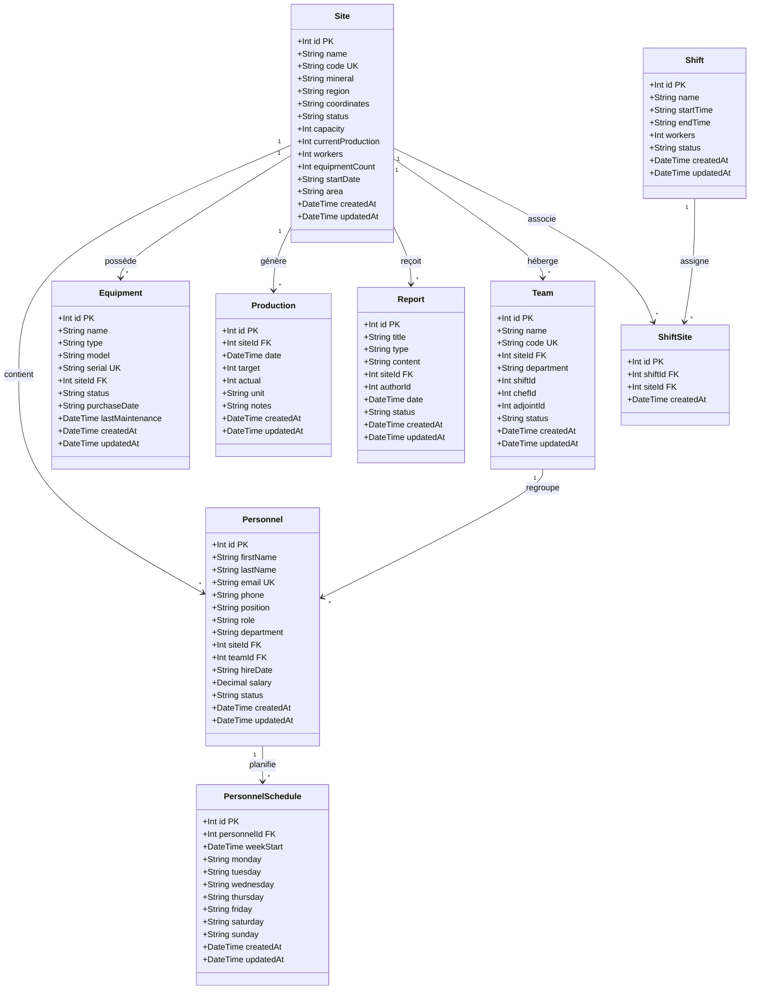

# Diagramme de Classes - Système de Gestion Minière

## Diagramme Mermaid

---

## Détail des Tables et Attributs

### 1. **Site** (Sites Minières)
| Attribut | Type | Contrainte | Description |
|----------|------|------------|-------------|
| `id` | Int | PK, auto | Identifiant unique |
| `name` | String | - | Nom du site |
| `code` | String | UK | Code unique (ex: MFN001) |
| `mineral` | String | - | Type de minerai |
| `region` | String | - | Région géographique |
| `coordinates` | String | - | Coordonnées GPS |
| `status` | String | default("active") | Statut (active/inactive) |
| `capacity` | Int | - | Capacité de production |
| `currentProduction` | Int | default(0) | Production actuelle |
| `workers` | Int | default(0) | Nombre d'ouvriers |
| `equipmentCount` | Int | default(0) | Nombre d'équipements |
| `startDate` | String | - | Date de démarrage |
| `area` | String | - | Superficie |
| `createdAt` | DateTime | default(now) | Date de création |
| `updatedAt` | DateTime | updatedAt | Date de modification |

### 2. **Personnel** (Employés)
| Attribut | Type | Contrainte | Description |
|----------|------|------------|-------------|
| `id` | Int | PK, auto | Identifiant unique |
| `firstName` | String | - | Prénom |
| `lastName` | String | - | Nom de famille |
| `email` | String | UK | Email unique |
| `phone` | String | nullable | Téléphone |
| `position` | String | - | Poste (chef, adjoint, ouvrier) |
| `role` | String | default("ouvrier") | Rôle (chef_equipe, adjoint, ouvrier) |
| `department` | String | - | Département |
| `siteId` | Int | FK → Site.id | Site d'affectation |
| `teamId` | Int | FK → Team.id, nullable | Équipe |
| `hireDate` | String | - | Date d'embauche |
| `salary` | Decimal | nullable | Salaire |
| `status` | String | default("active") | Statut |
| `createdAt` | DateTime | default(now) | Date de création |
| `updatedAt` | DateTime | updatedAt | Date de modification |

### 3. **Team** (Équipes)
| Attribut | Type | Contrainte | Description |
|----------|------|------------|-------------|
| `id` | Int | PK, auto | Identifiant unique |
| `name` | String | - | Nom de l'équipe |
| `code` | String | UK | Code unique |
| `siteId` | Int | FK → Site.id | Site d'affectation |
| `department` | String | - | Département |
| `shiftId` | Int | nullable | Quart de travail |
| `chefId` | Int | nullable | Chef d'équipe |
| `adjointId` | Int | nullable | Adjoint |
| `status` | String | default("active") | Statut |
| `createdAt` | DateTime | default(now) | Date de création |
| `updatedAt` | DateTime | updatedAt | Date de modification |

### 4. **Equipment** (Équipements)
| Attribut | Type | Contrainte | Description |
|----------|------|------------|-------------|
| `id` | Int | PK, auto | Identifiant unique |
| `name` | String | - | Nom de l'équipement |
| `type` | String | - | Type (engin, outil, etc.) |
| `model` | String | nullable | Modèle |
| `serial` | String | UK, nullable | Numéro de série |
| `siteId` | Int | FK → Site.id | Site d'affectation |
| `status` | String | default("operational") | Statut (operational/maintenance) |
| `purchaseDate` | String | nullable | Date d'achat |
| `lastMaintenance` | DateTime | nullable | Dernière maintenance |
| `createdAt` | DateTime | default(now) | Date de création |
| `updatedAt` | DateTime | updatedAt | Date de modification |

### 5. **Production** (Données de Production)
| Attribut | Type | Contrainte | Description |
|----------|------|------------|-------------|
| `id` | Int | PK, auto | Identifiant unique |
| `siteId` | Int | FK → Site.id | Site concerné |
| `date` | DateTime | - | Date de production |
| `target` | Int | - | Objectif |
| `actual` | Int | - | Production réelle |
| `unit` | String | default("tonnes") | Unité de mesure |
| `notes` | String | nullable | Notes |
| `createdAt` | DateTime | default(now) | Date de création |
| `updatedAt` | DateTime | updatedAt | Date de modification |

### 6. **Report** (Rapports/Incidents)
| Attribut | Type | Contrainte | Description |
|----------|------|------------|-------------|
| `id` | Int | PK, auto | Identifiant unique |
| `title` | String | - | Titre du rapport |
| `type` | String | - | Type (security, production, etc.) |
| `content` | String | - | Contenu |
| `siteId` | Int | FK → Site.id, nullable | Site concerné |
| `authorId` | Int | nullable | Auteur |
| `date` | DateTime | - | Date du rapport |
| `status` | String | default("draft") | Statut |
| `createdAt` | DateTime | default(now) | Date de création |
| `updatedAt` | DateTime | updatedAt | Date de modification |

### 7. **Shift** (Quarts de Travail)
| Attribut | Type | Contrainte | Description |
|----------|------|------------|-------------|
| `id` | Int | PK, auto | Identifiant unique |
| `name` | String | - | Nom (Matin, Après-midi, Nuit) |
| `startTime` | String | - | Heure de début |
| `endTime` | String | - | Heure de fin |
| `workers` | Int | default(0) | Nombre d'ouvriers |
| `status` | String | default("active") | Statut |
| `createdAt` | DateTime | default(now) | Date de création |
| `updatedAt` | DateTime | updatedAt | Date de modification |

### 8. **ShiftSite** (Association Shift-Site)
| Attribut | Type | Contrainte | Description |
|----------|------|------------|-------------|
| `id` | Int | PK, auto | Identifiant unique |
| `shiftId` | Int | FK → Shift.id | Quart de travail |
| `siteId` | Int | FK → Site.id | Site |
| `createdAt` | DateTime | default(now) | Date de création |
| **Contrainte** | UK(shiftId, siteId) | - | Unique par combinaison |

### 9. **PersonnelSchedule** (Planning du Personnel)
| Attribut | Type | Contrainte | Description |
|----------|------|------------|-------------|
| `id` | Int | PK, auto | Identifiant unique |
| `personnelId` | Int | FK → Personnel.id | Employé |
| `weekStart` | DateTime | - | Début de semaine |
| `monday` | String | nullable | Lundi (matin/apresmidi/nuit/none) |
| `tuesday` | String | nullable | Mardi |
| `wednesday` | String | nullable | Mercredi |
| `thursday` | String | nullable | Jeudi |
| `friday` | String | nullable | Vendredi |
| `saturday` | String | nullable | Samedi |
| `sunday` | String | nullable | Dimanche |
| `createdAt` | DateTime | default(now) | Date de création |
| `updatedAt` | DateTime | updatedAt | Date de modification |
| **Contrainte** | UK(personnelId, weekStart) | - | Unique par employé/semaine |

---

## Relations entre Tables

| Relation | Cardinalité | Description |
|----------|-------------|-------------|
| **Site → Personnel** | 1..* | Un site contient plusieurs employés |
| **Site → Equipment** | 1..* | Un site possède plusieurs équipements |
| **Site → Production** | 1..* | Un site génère plusieurs enregistrements de production |
| **Site → Report** | 1..* | Un site reçoit plusieurs rapports |
| **Site → Team** | 1..* | Un site héberge plusieurs équipes |
| **Site → ShiftSite** | 1..* | Un site est associé à plusieurs quarts |
| **Team → Personnel** | 1..* | Une équipe regroupe plusieurs employés |
| **Shift → ShiftSite** | 1..* | Un quart est associé à plusieurs sites |
| **Personnel → PersonnelSchedule** | 1..* | Un employé a plusieurs plannings |

---

## Légende
- **PK** = Primary Key (Clé primaire)
- **FK** = Foreign Key (Clé étrangère)
- **UK** = Unique Key (Contrainte d'unicité)
- **nullable** = Champ optionnel (peut être NULL)
- **default** = Valeur par défaut
